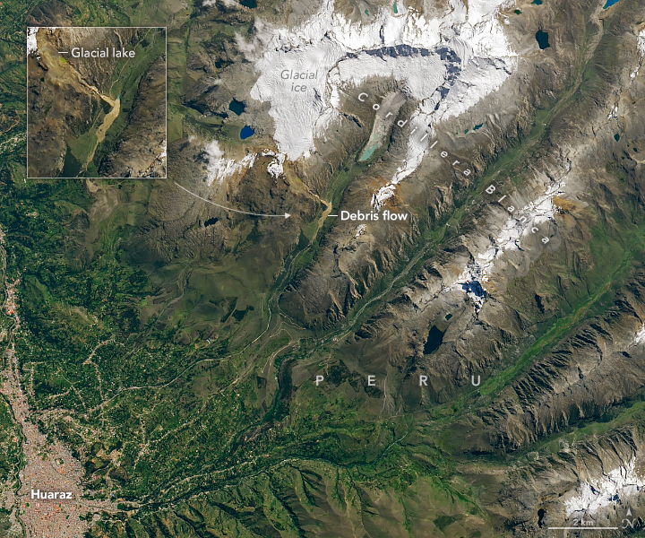
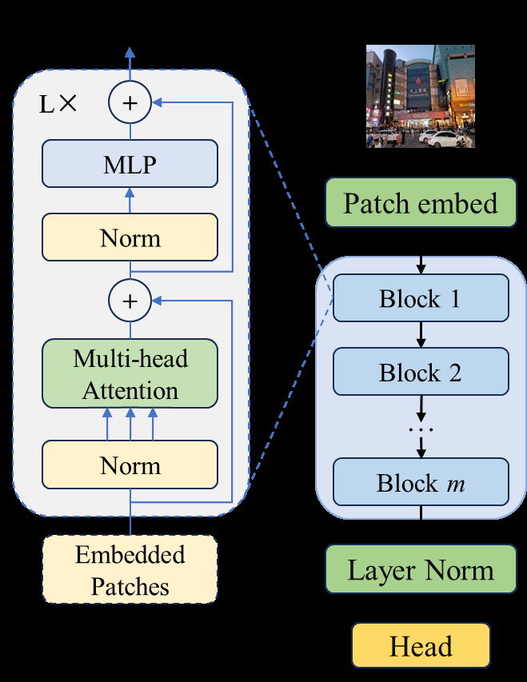

# GLOF Lake Segmentation using Modified DINOv2 ViT

[](https://opensource.org/licenses/MIT)
[](https://www.python.org/downloads/)
[](https://pytorch.org/)

## Overview

This project presents a modified version of the DINOv2 Vision Transformer (ViT-L/14) model for semantic segmentation of Glacial Lake Outburst Flood (GLOF)-prone lakes from satellite imagery. GLOFs are sudden releases of water from glacial lakes, posing significant risks to downstream communities, infrastructure, and ecosystems. Accurate segmentation of these lakes from remote sensing data is crucial for monitoring, risk assessment, and early warning systems.

The core innovation is the addition of a new transformer block to the DINOv2 backbone (increasing depth from 24 to 25 layers) and fine-tuning on 4 years of GLOF-specific satellite data. This enhancement improves the model's ability to capture complex spatial features in high-resolution imagery, leading to better segmentation performance in challenging remote sensing scenarios.




*Satellite imagery example of glacial lakes in a mountainous region, highlighting potential GLOF-prone areas (source: NASA Earth Observatory).*

## Problem Statement

Glacial lakes in high-mountain regions are expanding due to climate change, increasing GLOF risks. Traditional remote sensing methods (e.g., threshold-based segmentation) struggle with variability in lake appearance, shadows, clouds, and seasonal changes. Deep learning models like Vision Transformers offer promise but require adaptation for domain-specific tasks.

This project addresses:
- Accurate delineation of lake boundaries in satellite images (e.g., from Landsat, Sentinel-2).
- Handling temporal dynamics over 4 years of data to identify expanding or unstable lakes.
- Improving generalization in remote sensing by leveraging self-supervised pretraining (DINOv2) with structural modifications.

## Base Model: DINOv2 ViT-L/14

DINOv2 is a state-of-the-art self-supervised Vision Transformer model from Meta AI, pretrained on massive unlabeled image datasets. The ViT-L/14 variant features:
- Patch size: 14x14
- Embedding dimension: 1024
- Number of attention heads: 16
- Depth: 24 transformer blocks
- Input resolution: Typically 518x518 for high-detail remote sensing.

DINOv2 excels in feature extraction for downstream tasks like segmentation, thanks to its distillation-based self-supervision, which learns robust representations without labels.



*DINOv2 model architecture diagram, showcasing the transformer blocks and self-supervised learning pipeline (source: ResearchGate).*

The standard ViT architecture processes images by:
1. Dividing into patches and embedding them.
2. Adding positional encodings.
3. Passing through stacked transformer blocks (self-attention + MLP).
4. Using the [CLS] token for classification or features for segmentation.

In remote sensing, this helps capture global context in large satellite scenes.

## Model Modification: Adding a New Transformer Layer

We modify the DINOv2 ViT-L/14 by appending a 25th transformer block to the encoder stack. The new block is initialized as an identity function (zero weights for attention and MLP layers, zero LayerScale gamma) to preserve pretrained knowledge while allowing gradual adaptation during fine-tuning.

### Importance of the Added Layer
- **Deeper Feature Hierarchy**: In ViTs, additional layers enable better modeling of hierarchical features. For satellite imagery, this captures fine-grained details (e.g., lake edges) and broader context (e.g., surrounding glaciers and terrain).
- **Enhanced Capacity for Complex Patterns**: GLOF-prone lakes often exhibit subtle changes (e.g., water level fluctuations, ice dams). The extra layer increases the model's expressive power without disrupting lower-level features from pretraining.
- **Minimal Disruption**: Identity initialization ensures the modified model starts with performance close to the base DINOv2, making it efficient for fine-tuning.

In terms of deep learning, adding layers to neural networks (like in residual networks or transformers) allows for more abstract representations, reducing underfitting in high-dimensional data like remote sensing images.


*Vision Transformer architecture, illustrating the stacked transformer blocks where the new layer is added (source: GeeksforGeeks).*


*A general diagram of layers in an Artificial Neural Network, analogous to adding a new transformer block in ViT (source: GeeksforGeeks).*
## Modified Architecture
Modified Architecture (dinov2_modified.png):
Copy the original diagram, add a 25th block (highlight in red), and label as “New Transformer Block.”


Transformer Block (transformer_block.png):
Create a flowchart in Draw.io: Input → LayerNorm → Self-Attention → LayerScale → Residual → LayerNorm → MLP → LayerScale → Residual → Output.
Highlight LayerScale (gamma) as a DINOv2 feature.


GLOF Segmentation (glof_segmentation.png):
Download a Sentinel-2 image from Copernicus Open Access Hub.

## Fine-Tuning on 4 Years of GLOF Data

The modified model is fine-tuned on a dataset spanning 4 years of satellite imagery focused on GLOF-prone regions (e.g., Himalayas, Andes). This includes multispectral bands from sources like Sentinel-2 or Landsat, annotated for lake boundaries.

### Why New Layer + Fine-Tuning Helps
- **Domain Adaptation in Remote Sensing**: Pretrained on general images, DINOv2 benefits from fine-tuning to handle remote sensing specifics like atmospheric distortions, varying resolutions, and spectral bands. The 4-year temporal span captures seasonal and inter-annual variations, improving robustness to climate-induced changes.
- **Improved Segmentation Accuracy**: The added layer allows the model to learn more nuanced features during fine-tuning, e.g., distinguishing stable vs. outburst-prone lakes based on morphology and surrounding features. In ViTs, deeper encoders enhance self-attention across patches, crucial for large-scale satellite scenes.
- **Efficiency and Generalization**: Identity initialization minimizes catastrophic forgetting of pretrained weights. Fine-tuning on GLOF data reduces overfitting to general domains, achieving higher IoU/Jaccard scores for lake segmentation compared to base models.

In deep learning terms, this combines transfer learning (pretrained DINOv2) with architectural augmentation, enabling better gradient flow and feature reuse for specialized tasks.

## Installation

1. Clone the repository:
   ```
   git clone https://github.com/yourusername/glof-segmentation-dinov2.git
   cd glof-segmentation-dinov2
   ```

2. Install dependencies:
   ```
   pip install torch torchvision
   ```

3. Download the modified model checkpoint (custom_dinov2_vitl14_25blocks.pt) from the releases or generate it using the provided script.

## Usage

Load the model in PyTorch:
```python
import torch
from vision_transformer import dinov2_vitl14  # Assume the code from project

model = dinov2_vitl14(num_classes=1, depth=25)  # For binary segmentation (lake vs. non-lake)
model.load_state_dict(torch.load('custom_dinov2_vitl14_25blocks.pt'))
model.eval()

# Inference example
input_image = torch.randn(1, 3, 518, 518)  # Preprocess your satellite image
output = model(input_image)  # Add segmentation head if needed
```

For fine-tuning, use your GLOF dataset with a segmentation head (e.g., U-Net style decoder).

## Results

(Placeholder for metrics, e.g., mIoU on test set, comparison to base DINOv2.)

## Contributing

Pull requests are welcome. For major changes, please open an issue first.

## License

MIT License

## Acknowledgments

- DINOv2 by Meta AI.
- Satellite data sources: NASA, ESA.
- Inspired by remote sensing applications in climate monitoring.